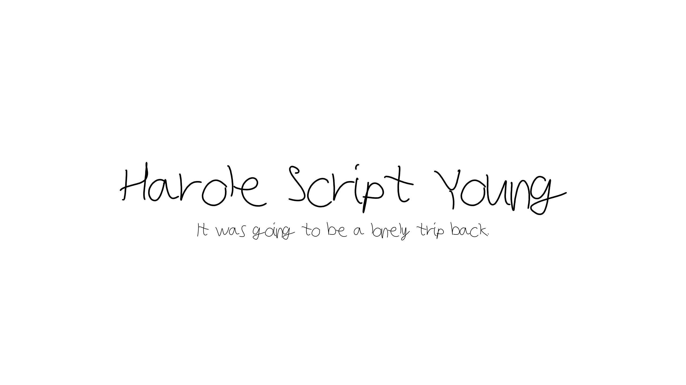

# Harole Script

Harole's handwriting as a usuable (but limited) font.

## Families

Young - My first attempt on handwriting digitization as a font made in [Microsoft Font Maker](https://apps.microsoft.com/store/detail/microsoft-font-maker/9N9209F8S3VC).

## Content Note

While I appreciate the feedback I have received, these are my own personal projects and I have no plans to add additional languages and features at this time. I am currently looking for ways to make this a reality, but for the moment I am focusing on the projects as they are and working to improve them. I'm open to any suggestions or ideas that could help make this possible, but until I can find a way to incorporate more languages, I am going to focus on the current projects.

---

<figure title="Harole's Signature">
    
Cheers,

    
    
- <b>Harole</b>

</figure>

## Content Note

While I appreciate the feedback I have received, these are my own personal projects and I have no plans to add additional languages and features at this time. I am currently looking for ways to make this a reality, but for the moment I am focusing on the projects as they are and working to improve them. I'm open to any suggestions or ideas that could help make this possible, but until I can find a way to incorporate more languages, I am going to focus on the current projects.

---

<figure title="Harole's Signature">
    
Cheers,

    
    
- <b>Harole</b>

</figure>
